# Yces Project

## Python MS Documenation - QR code generator

Python Webapp for Creating QR codes

Uses: Python,pywebio,Falsk,qrcode module
App Deployed on : Heroku  

About the webapp

This app generate QR codes in various color.Users can download it  directly after creation

It uses QRcode module for the generation of Codes

WEB interface is created using pywebio

Main code file : app.py

Note : Codes are documented to make it easy to understand

Screenshots:

**QR Code generator using CI/CD Pipeline** 

**TERM PROJECT** 

2023W CBD 2244 1 [B107] DevOps Fundamentals for Canadian Enterprises 

INSTRUCTOR: Mohammad Salim Course: DOCT 

Prepared by: 

`Athul Sukumaran (C0880215)`
`Om Vikas Kadam`
`Punam Pramod Jathar`
`Sonali Madhukar Lokare`
`Vaishnavi Vitthal Dube`
`Digvijay Laxman Vitkar`

**ABSTRACT** 

Continuous Integration/Continuous Deployment (CI/CD) is a development approach that helps streamline the software development process by automating various stages of the software development lifecycle. More than that, the primary aim of this project is to create e a Continuous Integration/Continuous Deployment pipeline for a QR code generator and scanner application. The application will be developed using Python and deployed in Docker containers, managed using Docker Swarm. The project uses a variety of DevOps tools such as Azure and AWS for building virtual machines, Terraform for infrastructure as code, Ansible for automation, Nagios for monitoring, and Jenkins for continuous integration and delivery. The Terraform is used to create the required infrastructure in Azure, including the resources like virtual networks, subnets, security groups, and virtual machines ![ref1]

**INTRODUCTION** 

This project focuses on implementing a Continuous Integration/Continuous Deployment (CI/CD) pipeline for a software development team. This project aims to automate the entire software development lifecycle, from code changes to deployment, while ensuring quality and reliability. The CI/CD pipeline consists of multiple stages, including building, testing, and deploying the application. Used modern tools and technologies such as Git, Jenkins, Docker, and Kubernetes to automate the pipeline in this project. 

The CI/CD pipeline will automate the application's build and deployment processes, ensuring that the most recent changes are smoothly integrated, tested, and deployed. Jenkins will be used as the continuous integration tool, automatically initiating builds, testing, and deploying changes anytime they are uploaded to the code repository. The source code is committed to the version control system GIT, and updates are automatically grabbed by Jenkins before being tested and deployed as a Docker Swarm container. Terraform will be used to automate the provisioning of the cloud infrastructure that will host the docker swarm cluster, while Ansible will be used to manage the life cycle of the docker containers that will operate in the docker swarm cluster. 

Clients will benefit from numerous aspects of the project, including faster and more reliable deployments, decreased human tasks, and increased application quality. As a result, implementing a CI/CD pipeline for the QR code generator and scanner application would increase the efficiency and reliability of the application development and deployment process dramatically. Another key feature that improves the end-user experience is high availability and fault tolerance. ![ref1]

**Pipeline Architecture: ![ref1]**

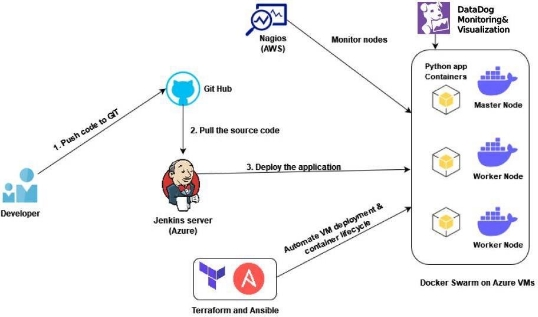

**Methodology** 

**Step 1: Create the application using Python** 

The application is created using Python, and the code is stored in the version control system (Github) repository. The source code is available in the below git URL. 

- Application is a web app that uses the Pywebio framework 
- It generates two types of codes, **QR codes and Bar codes.** 
- It also allows users to download the generated codes 

GitHub URL:[ ycesproject-devops/app.py at main · ycesproject/ycesproject-devops (github.com) ](https://github.com/ycesproject/ycesproject-devops/blob/main/app.py)Source code: ![ref1]

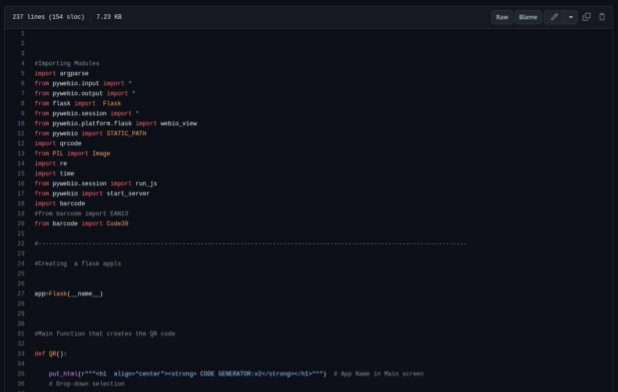**Step 2: Create the Virtual machines in Azure for the Jenkins server and Docker swarm.** 

Two virtual machines are created in the Azure cloud platform named Jenkins master server and Docker. The Jenkins server is used for automation purposes, and Docker is used for application deployment. 

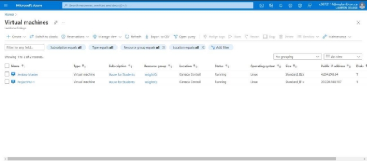

**Step 3: Pull the Source code from the GitHub repository to the Jenkins server using pipelines.** 

Jenkins is an open-source automation server used for building, testing, and deploying software. It provides a wide range of plugins and integrations with other tools, allowing it to be customized to meet the needs.Used the Jenkins tool to automate the entire software development lifecycle, from building and testing code to deploying in Docker environments. ![ref1]

When any changes are made to the source code stored in the GitHub repository Jenkins will automatically pull the source code using the Git WebHook feature and initiate the Jenkins pipeline. 

**The Deployment stages in Jenkins:** 

- Stage-1: Declarative: Checkout SCM 

If any new changes are pushed to the repository Jenkins triggers the job 

- Stage-2: Clone GitHub Repository 

In this stage cloning the Git Hub repository and updating the app.py file. 

- Stage-3: Copy source code to Docker swarm 

The updated source code is then pushed to Docker Swarm 

- Stage-4: Build & Push the new Image to the Docker hub 

Docker will build a new image using the updated code and push this image to Docker Hub 

- Stage-5: Deploying new Service in Docker Swarm 

A new service is deployed using the image and updated changes are reflected in the application. ![ref1]

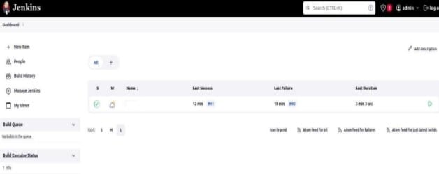

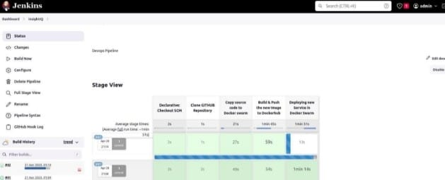

**Step 5: Deployment of the application using Docker Swarm ![ref1]**

Docker is a software platform that allows developers to create, deploy, and run applications in containers easily. Containers are lightweight, portable, and self-contained environments that can run an application and all its dependencies. The Updated source code is pulled to docker from the Jenkins server. 

- Docker swarm is a container orchestration platform consisting of a cluster of Docker Nodes (Master and Worker) 
- It helps in the high availability and fault tolerance of containers 
- Have 2 nodes, one Master and another Worker 
- Master node controls the cluster operations. 
- Cluster is built on top of Azure Virtual machines 

Once the image is built by the docker, it will be pushed and stored in Docker Hub. 

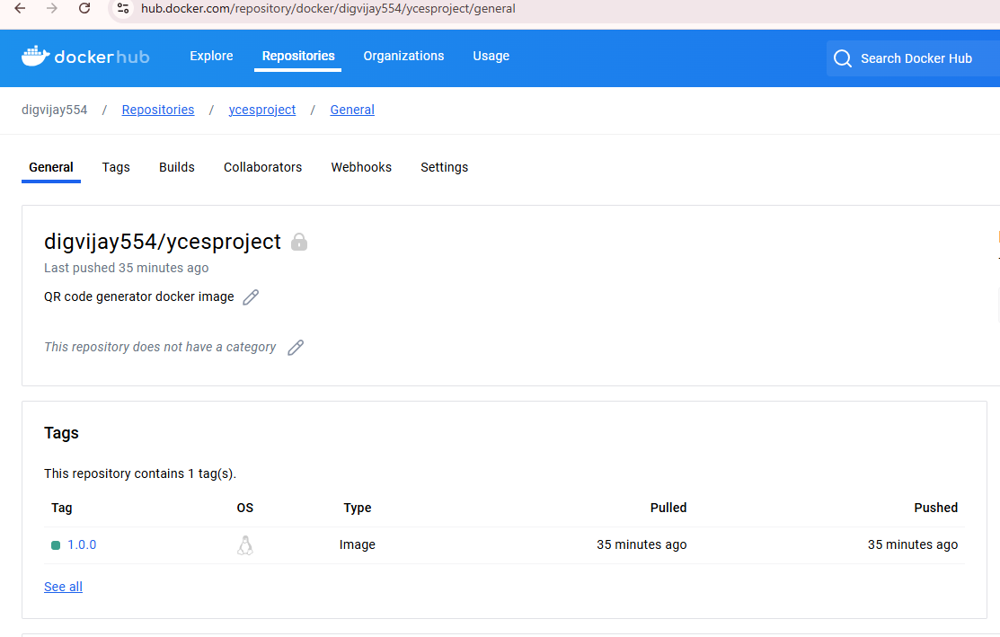

This image is pulled by the docker swarm. Using this image, created a docker swarm service with two replicas running on two different nodes for high availability and fault tolerance. ![ref1] The service is listening on port 80, and have deployed an Azure load balancer that will distribute the traffic between the two docker servers. 

Docker swarm running service (ycesproject) with 2 replicas. 

Containers are distributed across 2 nodes 

Details of Nodes participating in the cluster 

Docker swarm service: A service defines the tasks to execute on the manager or worker nodes. Service can run across multiple nodes and support advanced features like replication, high availability, automated container migration, etc. 

**Infrastructure as Code (Terraform) ![ref1]**

- Used Terraform as an Infrastructure as a code tool to deploy our virtual machines. 
- Resources are created using the Azure provider 
- Following resources are created: 
- Resource group, VM, security group, Virtual network 
- network interface, Public IP. 

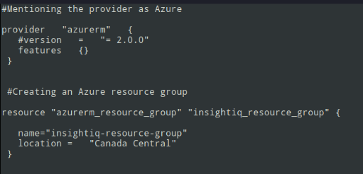

**Configuration Management (Ansible)** 

- Used Ansible as a configuration management tool to automate the container lifecycle. 
- By using the Ansible playbook, did the following tasks 
- Copy the code to the remote docker server 
- Destroy the previously running containers before deploying new containers ![ref1]
- Build, and push the docker image to the docker hub 

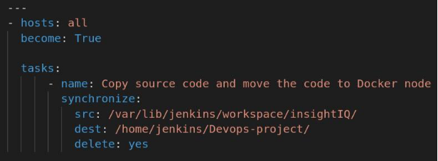

**Step 6: Monitoring the VMs using Nagios Overview of Nagios:** 

Monitoring is an essential aspect of the DevOps pipeline. It helps in ensuring that the application infrastructure and its components are running smoothly and efficiently. One of the most significant advantages of monitoring is its ability to identify issues before they become critical, reducing the downtime of the application. ![ref1]

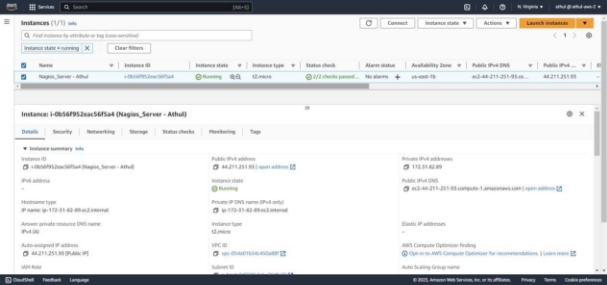

Nagios is an open-source monitoring tool that provides real-time monitoring of the application infrastructure and its components. In our project, have opted to use the AWS cloud service to provide High Availability (HA) for the monitoring part. This ensures that the monitoring system is always available, even in the case of failure of Azure service where the remote hosts are deployed. AWS is a reliable cloud service provider offering various tools and services to ensure high availability, scalability, and security. To deploy Nagios, have used the Apache web server. The Apache web server is a widely used web server known for its stability and security. Nagios can be deployed on the Apache web server to provide a robust andscalable monitoring system. 

**Nagios Configuration:** 

**Nagios Configuration:** 

Nagios configuration is a crucial step in setting up an effective monitoring solution for any application infrastructure. Nagios will be used to monitor the virtual machine running the applications. This will include defining checks, notifications, and escalations to ensure the smooth operation of the application. As part of the Nagios configuration, device information such as hostname, IP address, and other details will be marked. This will help in identifying the ![ref1] virtual machine quickly and taking appropriate action in case of any issues. In addition, the configuration of Nagios will include setting up a dashboard for real-time monitoring and alerts for critical issues. The dashboard will provide a comprehensive view of the health and status of the virtual machine and the services it is running. This will help in identifying issues early on and taking corrective action before they impact the application’s performance or availability. 

**Nagios Dashboard:** 

The Nagios dashboard is a critical component of the Nagios monitoring system that provides a comprehensive view of the health and status of the virtual machine, network, and services of the application. It provides a centralized location for monitoring various components and services, making it easier to manage and troubleshoot issues. The right side of the Nagios dashboard interface provides various analysis tools and services that can be used to judge the availability and performance of virtual machines. These tools and services include graphs, charts, and tables that display metrics such as CPU usage, memory usage, and network bandwidth. 

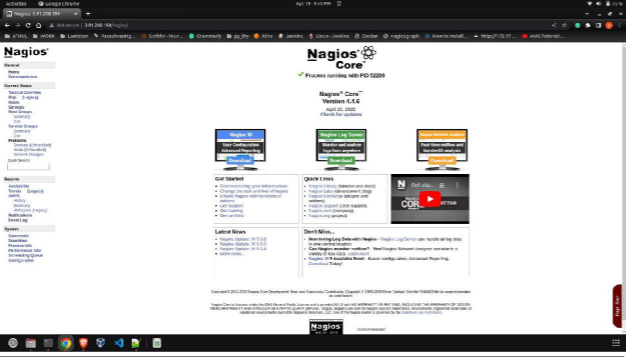

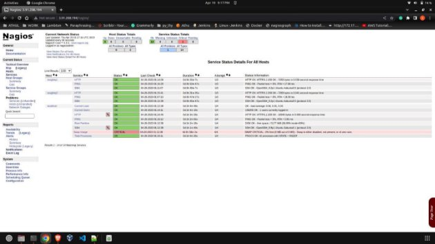

**Nagios Plugins:** 

Nagios plugins are essential components of the Nagios monitoring system that allow you to monitor various components and services of remote host machines. One of the most commonly used Nagios plugins is the NRPE (Nagios Remote Plugin Executor) plugin, which enables you to execute plugins on remote hosts. This plugin allows you to monitor various aspects of the application, such as CPU usage, disk space, and memory usage. By monitoring these critical resources, you can identify potential issues before they cause significant downtime or failure of the application. 

The metrics monitored by Nagios plugins are customizable, allowing you to configure them to meet your specific monitoring requirements. This provides a significant advantage in terms of providing a comprehensive view of the application's health and performance, which is ![ref1] vital for identifying and resolving potential issues. The NRPE daemon runs on the remote host, and the check\_nrpe plugin runs on the Nagios server. The check\_nrpe plugin sends requests to the NRPE daemon on the remote host to execute the desired plugin and return the results. This communication between the Nagios server and the NRPE daemon enables the monitoring of a wide range of metrics, which is essential for ensuring the application's health and performance. 

**Nagios Reporting:** 

Nagios reporting is a powerful feature that provides comprehensive insights into the performance and trends of the monitored infrastructure. Reports can be generated for each remote host as well as the local host. These reports provide detailed information about the performance metrics, including the uptime, availability, and response time of the monitored services. The reports also help in identifying issues and improving the efficiency and reliability of the application by highlighting the areas that require attention. The data is presented in an easy-to-understand format, making it easier for the DevOps team to take corrective actions. ![ref1]

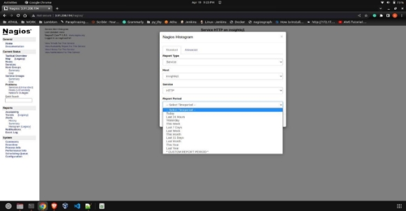

**Nagios Notifications:** 

Nagios has a powerful notification system that can be used to alert DevOps teams about any issues detected during monitoring. This feature plays a crucial role in reducing the downtime of the application by notifying the responsible team as soon as an issue is detected. 

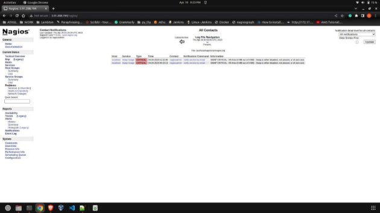

The customizable email templates of Nagios can be configured to include detailed information about the problem, its severity, and its potential impact on the application or infrastructure. This helps DevOps teams quickly identify the issue and take necessary action to resolve it. Nagios allows you to configure email notifications to be sent to specific individuals or groups based on their roles or responsibility. This feature ensures that the right person or team is notified about the issue, reducing the response time and improving the overall efficiency of the monitoring system. ![ref1]

**Step 7: Elaborated visualization of the VMs performance using DataDog.** 

Datadog is a cloud monitoring tool that provides real-time insights into the performance of applications, infrastructure, and networks. In this technical report, I will document the steps I have taken to install and configure the Datadog agents and create a dashboard for monitoring a web application. 

- Installation and Configuration of Datadog Agents: 
- Sign up for a Datadog account: First, have to sign up for a Datadog account by visiting their website and creating an account. 
- Install the Datadog Agent on the server: have installed the Datadog Agent on the server 

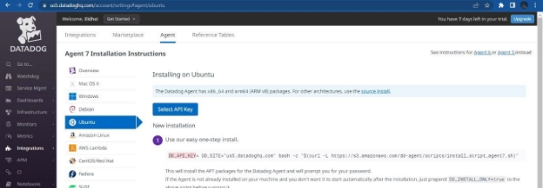

Start the Datadog Agent: After configuring the Datadog Agent, start it using the following command:  *“sudo systemctl start datadog-agent”* 

- Log in to Datadog: After starting the Datadog Agent. 
- Create a new dashboard: In the Datadog dashboard, create a new dashboard by clicking on the “New Dashboard” button. ![ref1]

Add widgets to the dashboard: I added various widgets to the dashboard to monitor my web application’s performance. For example, I added a widget to monitor the system CPU and system RAM and SWAP. ![ref1]

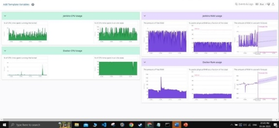

**Conclusion** 

In conclusion, the Continuous Integration/Continuous Deployment (CI/CD) approach is an essential element of modern software development that helps streamline the software development process by automating various stages of the software development lifecycle. This project demonstrates the practical application of CI/CD by creating a pipeline for a QR code generator and scanner application using Python and Docker containers managed by Docker Swarm. The project leverages a variety of DevOps tools such as Azure, AWS, Terraform, Ansible, Nagios, and Jenkins to enable continuous integration and delivery. With Terraform, the required infrastructure in Azure, including virtual networks, subnets, security groups, and virtual machines, can be created seamlessly. This project provides a clear example of how DevOps tools can be used to simplify the software development process and improve the efficiency and reliability of software delivery. For monitoring, the Nagios is an essential tool in the DevOps pipeline that helps in identifying issues, reducing downtime, and improving the efficiency and reliability of the remote hosts. Nagios configuration, dashboard, plugins, reporting, and notifications provide a comprehensive view of the VM’s health and performance. ![ref1]

**References** 

1. *PyWebIO - Build full stack web app with Python*. (n.d.). 

[https://www.pyweb.io/ ](https://www.pyweb.io/)

2. *Swarm mode overview*. (2023, February 9). Docker Documentation. [https://docs.docker.com/engine/swarm/ ](https://docs.docker.com/engine/swarm/)
2. *Table Of Contents · Nagios Core Documentation*. (n.d.). [https://as-sets.nagios.com/downloads/nagioscore/docs/images/nagioscore/4/en/toc.html ](https://as-sets.nagios.com/downloads/nagioscore/docs/images/nagioscore/4/en/toc.html)
2. *Getting Started with the Agent*. (n.d.). Datadog Infrastructure and Application Monitoring. [https://docs.datadoghq.com/getting_started/agent/ ](https://docs.datadoghq.com/getting_started/agent/)
2. Trapani, K. (2023). How to Integrate Jenkins with GitHub. *Cprime*. [https://www.cprime.com/resources/blog/how-to-integrate-jenkins-github/ ](https://www.cprime.com/resources/blog/how-to-integrate-jenkins-github/)![ref1]

[ref1]: docs/images/002.png

